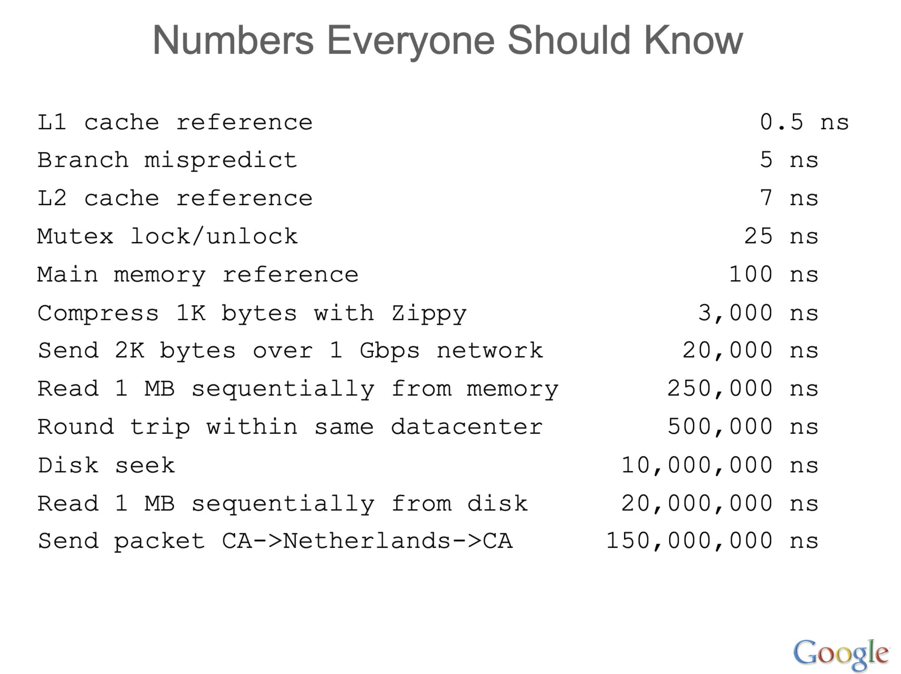

# What Every Programmer Should Know

#### A curated list of articles, blog posts and videos

## CPU
- [What Every Programmer Should Know about How CPUs Work](https://www.youtube.com/watch?v=-HNpim5x-IE) Matt Godbolt • GOTO 2024

## Memory
- [What Every Programmer Should Know About Memory](https://people.freebsd.org/~lstewart/articles/cpumemory.pdf) Ulrich Drepper, Nov 21, 2007

## Floating-Point Arithmetic
- [What Every Computer Scientist Should Know About Floating-Point Arithmetic](https://docs.oracle.com/cd/E19957-01/806-3568/ncg_goldberg.html)

## Performance

- [Performance Hints](https://abseil.io/fast/hints.html#performance-hints), Jeff Dean, Sanjay Ghemawat, Dec 16, 2025

## Concurrency
- [Concurrency is not Parallelism](https://www.youtube.com/watch?v=oV9rvDllKEg), [Rob Pike](https://en.wikipedia.org/wiki/Rob_Pike), co-designer of the Go programming language
- [Concurrency is not Parallelism: Slides](https://go.dev/talks/2012/waza.slide)

## [SIMD](https://en.wikipedia.org/wiki/Single_instruction%2C_multiple_data) for Code Optimization
- [Optimizing software in C++: An optimization guide for Windows, Linux and Mac platforms](https://agner.org/optimize/optimizing_cpp.pdf), Prof. Agner Fog, Technical University of Denmark 

## Linux Kernel
- [The Path of a Packet Through the Linux Kernel](https://www.net.in.tum.de/fileadmin/TUM/NET/NET-2024-04-1/NET-2024-04-1_16.pdf), Alexander Stephan, Lars Wüstrich
